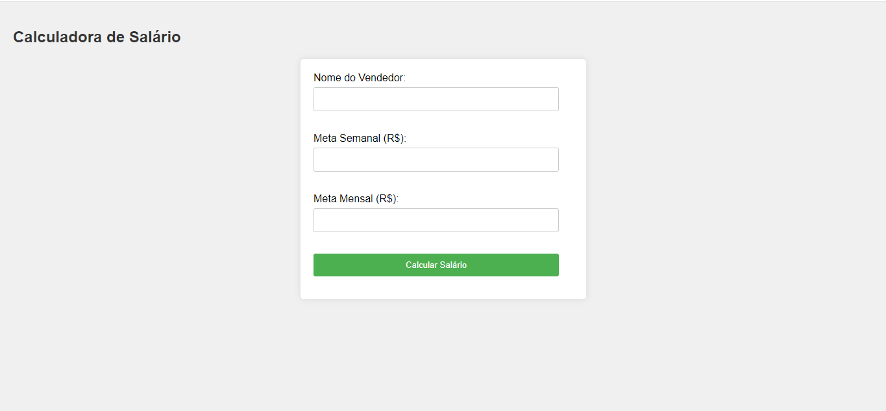

# Sistema_salario

# Calculadora de Salário

Este é um simples aplicativo de calculadora de salário desenvolvido em PHP e HTML para ajudar a calcular o salário de um vendedor com base em suas metas semanais e mensais.

## Funcionalidades

- Permite que o usuário insira o nome do vendedor, a meta semanal e a meta mensal.
- Calcula o salário base do vendedor, bônus semanal e bônus mensal com base nas metas atingidas.
- Exibe o resultado para o usuário, incluindo o nome do vendedor, salário base, bônus semanal, bônus mensal e salário final.

## Como Usar

1. Abra o arquivo `index.php` em qualquer navegador da web.
2. Insira o nome do vendedor, a meta semanal e a meta mensal nos campos correspondentes.
3. Clique no botão "Calcular Salário" para ver o resultado.

## Detalhes Técnicos

- O arquivo `index.php` contém o código HTML, PHP e css para a interface do usuário e o cálculo do salário.
- O código PHP verifica se os dados foram enviados pelo formulário e realiza os cálculos necessários com base nas metas fornecidas.
- O salário base do vendedor é definido como R$ 2000, mas pode ser ajustado conforme necessário.
- O bônus semanal é calculado como 1% da meta semanal atingida se a meta for de pelo menos R$ 20.000.
- O bônus mensal é calculado como 10% do excesso da meta mensal acima de R$ 80.000, desde que a meta semanal também tenha sido atingida.

